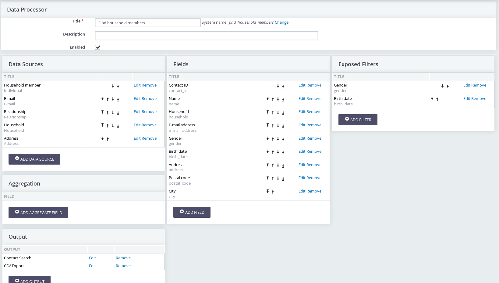
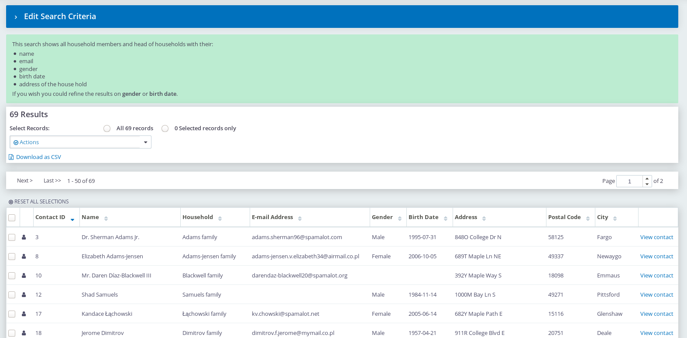

# Data Processor

The data processor is an extension with which system administrator can do the following:

* Create custom searches with optional the possibility to export the results
* Create an API to fetch data. This is quite useful if you have external systems which need data from CiviCRM.
* ... and developers can enhance the outputs of the data processor so that much more is possible, even things we haven't thought of yet.

Below a screenshot of the configuration screen

And below a screenshot of the above data processor in action as a custom search:

The extension is licensed under [AGPL-3.0](LICENSE.txt).

## Documentation

* [How to create a search with the data processor](docs/how_to_create_search.md)
* [Using API output to fetch the results in data processor](docs/HowToAddAPIDataOutput.md)
* How to export and import a data processor

## Related extenions

* [dataprocessor-token-output](https://lab.civicrm.org/extensions/dataprocessor-token-output) Create tokens from a data processor
* [dataprocessor-vega-graphs](https://lab.civicrm.org/extensions/dataprocessor-vega-graphs) Graph output of a dataprocessor

## Developer documentation

* Enhancing the data processor
* [Available Hooks](docs/hooks.md)
* [Add your own data source for a CiviCRM Entity](docs/add_your_own_datasource.md)
* Add your own data source for a CSV File
* How to store a data processor in code in your extension
* [Data Flow Classes](docs/dev/DataFlowClasses.md) - Overview of all the available data flow classes.
* [Develop PHPUnit TestCase for the extension](docs/how_to_create_test.md)

## Installation

Install this extension by downloading it from https://lab.civicrm.org/extensions/dataprocessor/-/archive/master/dataprocessor-master.zip
and then upload it to your civicrm server in the extension folder.
And then press install in the Administer -->  System Settings --> Extensions screen.

## Optional

To get more information about each fields in DataProcessor. A CiviTutorial has been created, to view tutorial install CiviTutorial Extension.

To Install CiviTutorial in the Administer -->  System Settings --> Extensions screen. (Found in Add New)
