# How to create a search

In this tutorial we are going to create a search action. We search all people who have an active relationship with a household.
We will show the name, e-mailaddress of the person and we will show the name and address of the household. 

We will also add an additional filter to the search so the user can search on gender and/or birth date.

Our search will look like as follows:

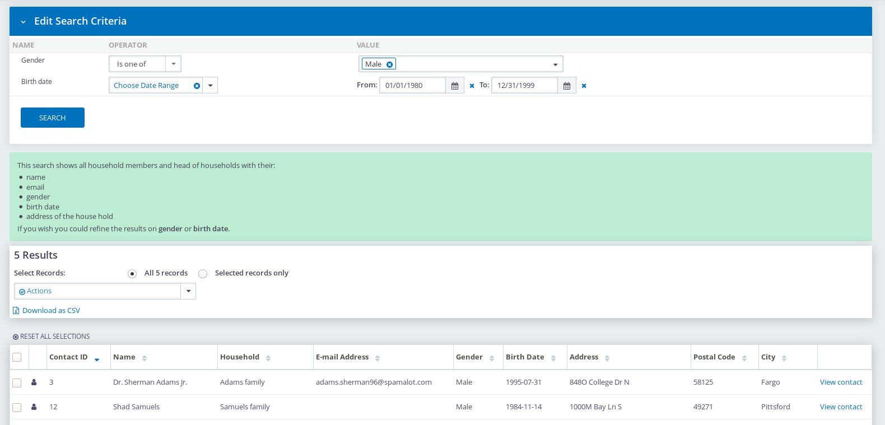

## Create the data processor

Go to Administer --> Data Processor --> Add data processor. 
Give your data processor an title. You can also add a description, the description is only shown in the *manage data processors* screen.

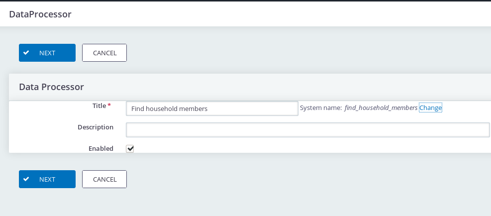

Press *Next*.

## Add the data sources

In the next step we will add the data sources. A data processor has at least one data source. 
A data source could be CiviCRM entity, such as Individual, Household, Activity, Relationship etc. Or it could be something else, e.g. a CSV file.

### Add a data source for the household member
In this tutorial we start with adding the data source for *Individual*
To do so press *Add data source*

Select as type *Individual* and give your data source an title. In our example give it the title of *Household Member*.
If you wish you can filter the Individuals, by default only individuals who are alive and not deleted are retrieved.

After you have configured the data source press *Save*.

This is how our data source should look like:

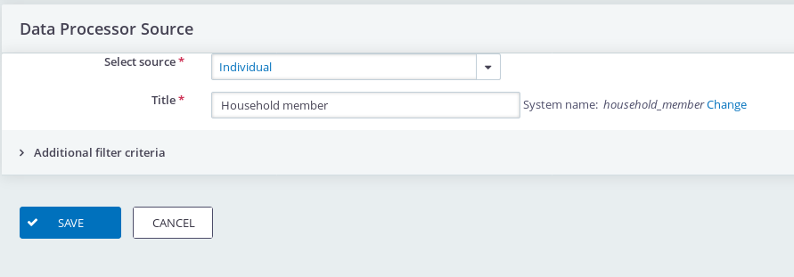

### Add a data source for the e-mail address of the household member

Now it is time to add a data source to retrieve the e-mail address of the household member.
Press *Add data source* 

Select as type *E-mail* and give it a title such as *E-mail*.
Leave the filter criteria to use the primary e-mail address. 
At the join section we will link this E-mail data source the *Household Member* data source. 

Select at the *Select fields to join on (not required)* as Join Type. And select 
*Email Contact* = *Household Member :: Contact ID* as join fields.

Press *Save*.

This is how the e-mail data source should look like:

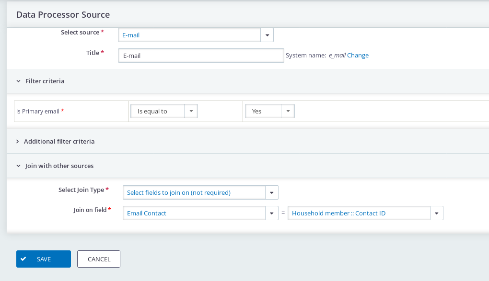

**What is a join?**

A  join connects two data sources to each other. In the example above we link the e-mail to the individual. We did this \
with the field *Email Contact* -  which is a field on the CiviCRM E-mail entity which holds the contact id - and we link it the Contact ID
of the *Household Member*.

**What does 'Select fields to join on (not required)' mean?** 

This means that the data processor tries to link an e-mail address to the household member, but what if the household member 
does not have an e-mail address? The not required means in this case the household member still appears in our data set but with an
empty e-mail address.

### Add the Relationship data source

In this step we add a data source for the *Relationship* between the household member and the household. Later on we will add
the household data source.

Press *Add data source*

At type select *Relationship*. Give it the title *Relationship*. At Filter criteria select by relationship type *Household Member* and *Head of household* 
and set is active to yes. This means we only want to show activity relationship with a household. 

At the join configuration select *Select fields to join on* and set fields to *Contact A* = *Household member :: Contact ID*.

Press *Save*

This is how the relationship data source should look like:

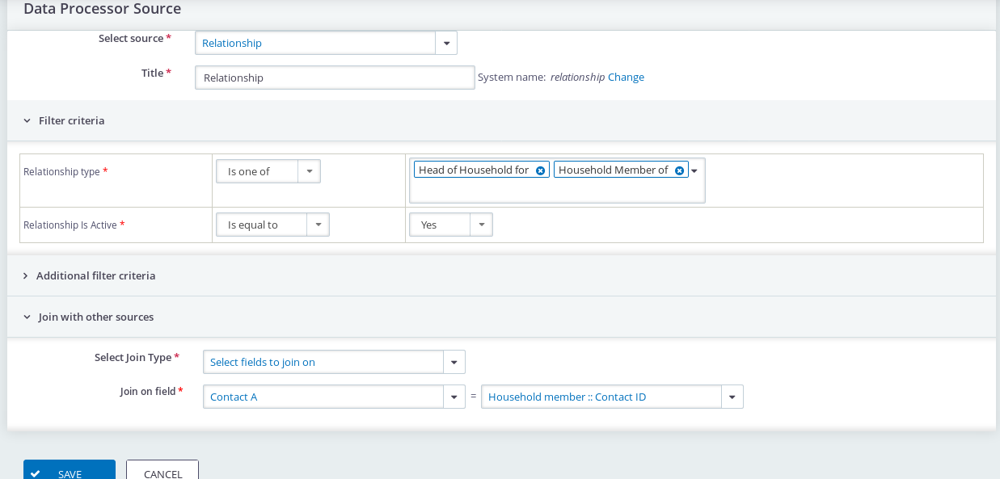

**Why do we use 'Select fields to join on'?**

This join type means that only records who are present in both data sources are retrieved. Meaning that as an Individual does 
not have an active relationship it will not be present in the data processor. 

### Add the Household data source

In this step we will add the Household data source. We *join* this data source to the relationship data source on *Contact B* of the relationship.

Press *Add data source*

Select as type *Household* and give the data source the title *Household*.

At the join configuration select *Select fields to join on* and set fields to *Contact ID* = *Relationship :: Contact B*.

Press *Save*

This is how the household data source should look like:

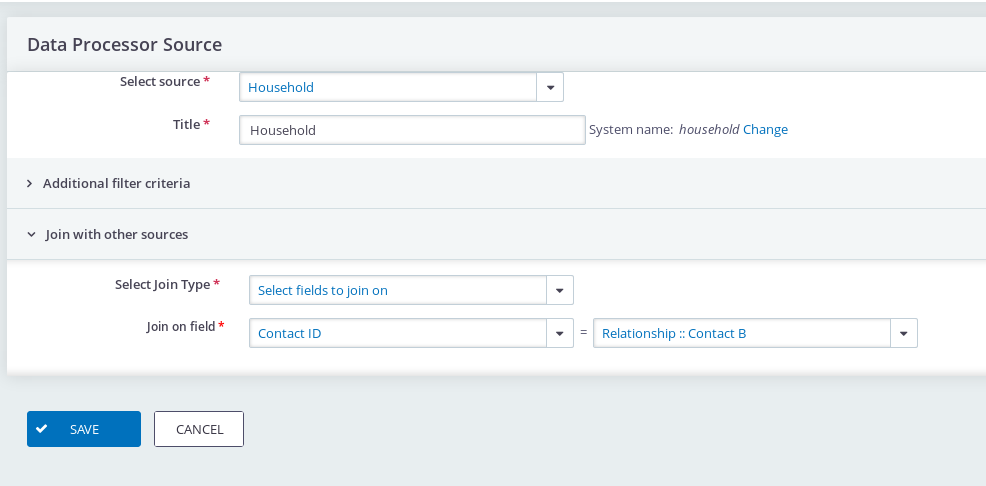

### Add the address data source

The last data source is the address data source and this data source will be joined to the household data source.

Press *Add data source*

Select as type *Address* and give the data source the title *Address*

Select at the *Select fields to join on (not required)* as Join Type. And select 
*Contact ID* = *Household :: Contact ID* as join fields.

Press *Save*

The address data source should look like:

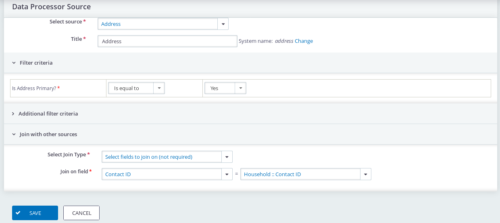

## Add the fields

We want to add the following fields:

* Contact ID of the household member; we need this field so that the user can select the contact to perform actions on it e.g. Send an e-mail or add to an group. 
* Name of the household member
* Household name
* E-mail address of the household member
* Gender
* Birth date
* Address
* Postal code
* City

Press *Add Field* and select *Household Member :: Contact ID* and give it the title *Contact ID*. See screenshot below.

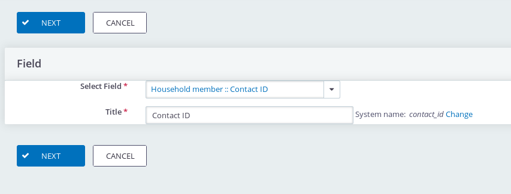

Press *Add Field* and select *Household Member :: Display name* and give it the title *Name*.

Press *Add Field* and select *Household :: Display name* and give it the title *Household*.

Press *Add Field* and select *E-mail :: Email* and give it the tThe filters which thitle *E-mail address*.

Press *Add Field* and select *Household Member :: Gender (Option)* and give it the title *Gender*. 

> There are two fields for gender one with the addition '(option)' and one without. The first one shows the label of the option
> the latter the value. E.g. in CiviCRM the value 1 for gender has the value of Female.

Press *Add Field* and select *Household Member :: Birth Date* and give it the title *Birth Date*.

Press *Add Field* and select *Address :: Street Address* and give it the title *Address*. 

> Street address is the CiviCRM field which holds the full address, e.g. street name plus housenumber.
    
Press *Add Field* and select *Address :: Postal code* and give it the title *Postal code*.

Press *Add Field* and select *Address :: City* and give it the title *City*.

Now we are finished with defining which fields we want to present to the user. 

## Add the exposed filters

In this step we add the exposed filters. A filter is something the user can use to refine the search the results. 
We will add a filter for Gender and for Birth Date. An exposed filter could be required which means that the user
first needs to enter a value for the filter before performing the search. 

Press *Add Filter* and select *Field FIlter* as filter type. Give the filter the title *Gender* and 
select *Household Member :: Gender* as field. Press *Save*

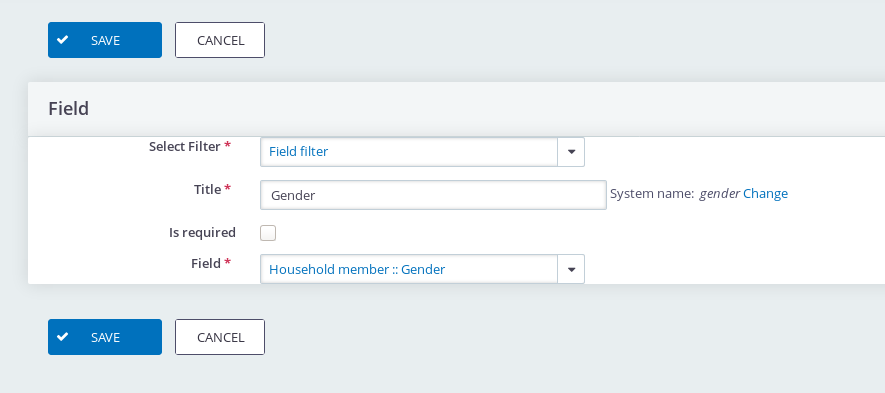

Press again *Add Filter* and select *Field Filter*  as filter type. Give the filter the title *Birth date* 
and select *Household Member :: Birth Date* as Field. Press *Save*

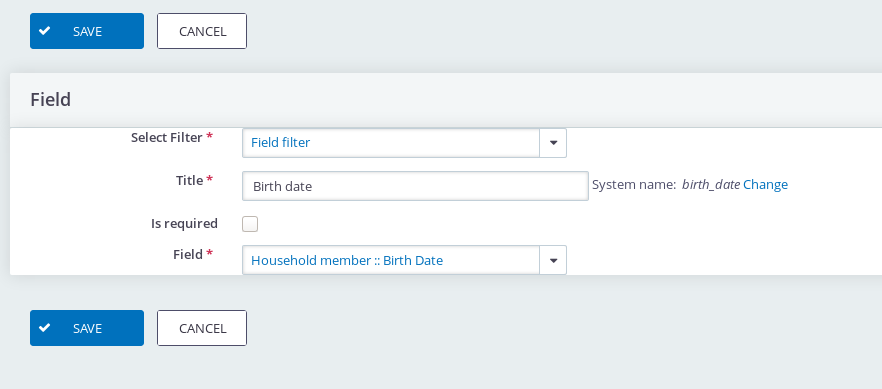

## Add the Contact Search Output.

Each data processor have one or more outputs. An output defines how the data processor is accessible. At the moment
you can chose between Contact Search, Activity Search, API or CSV Export. In this example we will both use the Contact Search and the CSV Export.
The latter will present a button on the search screen to download the search results as a CSV file. 

### Add the contact search output

Press *Add output* and select *Contact Search*. At parent menu, select *Search*. This option defines where the user can
go to the search. Optional you can define what permission a user needs to have.
At *Contact ID field* select the field *Contact ID*.

Optional write some instructions for your user. 

Press *Save*

The configuration of the Search output looks like:

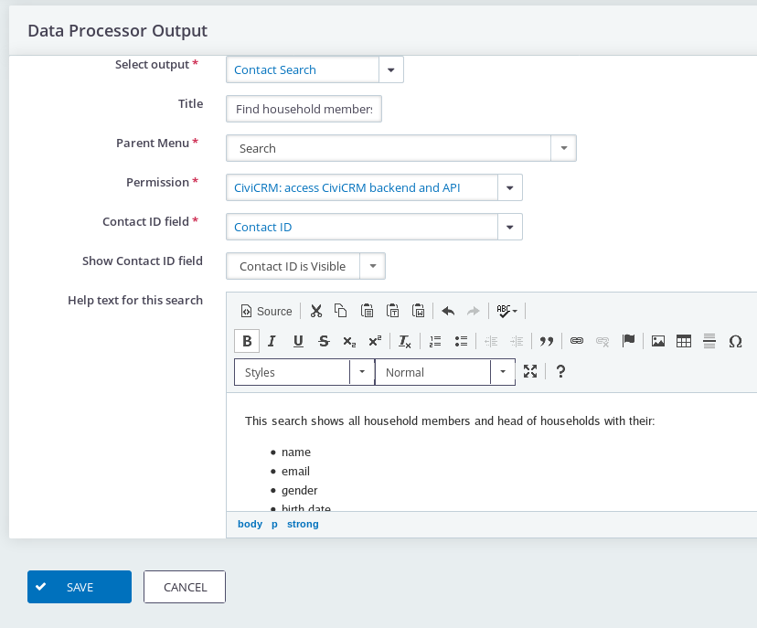

### Add the CSV Export output

Press *Add output*  and select *CSV Export*. The CSV Export does not have any additional configuration options.

If you don't want that the user can download the search result as a CSV file you omit this step.  

## Start using the search

Now go to *Search --> Find Household Members* and use the just defined search.

The search looks like:

You see all the people who have an active relationship with an household. 

You also see a button to download the results as CSV File. 

And if you select one or more contacts you can perform the same actions as you can with a normal contact search. 

> If you want to create your own actions you can use the [Search Action Designer](https://lab.civicrm.org/extensions/searchactiondesigner) extension.
    
To refine the search results press *Edit Search Criteria* and you will see the screen below:

